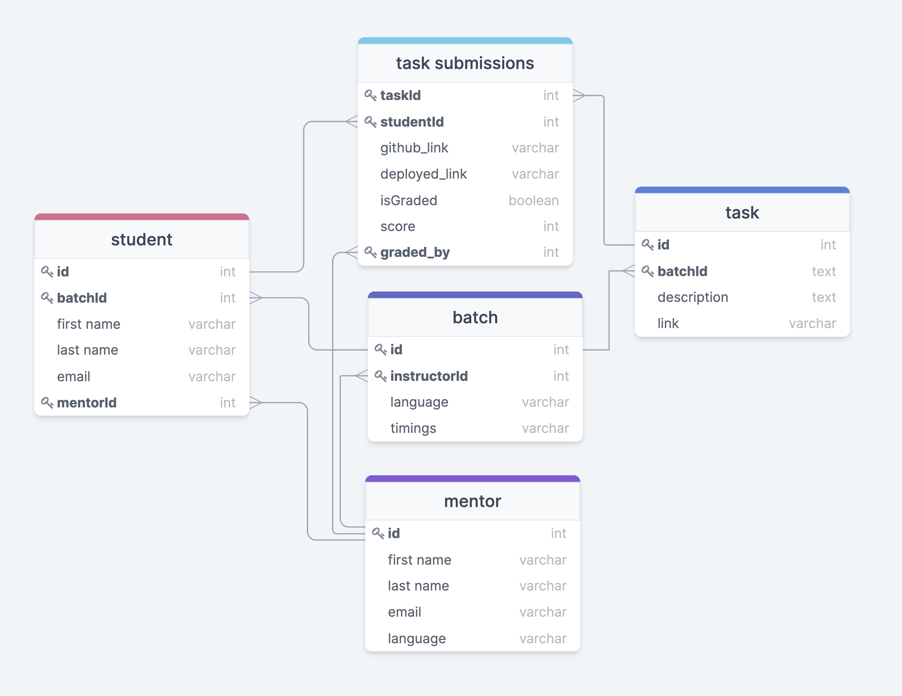

# Database design

 

# Tables

- batch
  - pk(primary key) - id
  - fk(foreign key) - instructorId
- mentor
  - pk - id
- student
  - pk - id
  - fk - batchId, mentorId
- task
  - pk - id
  - fk - batchId
- task submissions
  - pk - (taskId, studentId)
  - fk - taskId, studentId, gradedBy

 
 

# Relations

### batch to student (one to many)

- a batch can have multiple students
- student can be part of only one batch ( batchId )

### mentor to batch (one to many)

- a mentor can be an instructor of multiple batches

### mentor to student (one to many)

- a mentor can have multiple students under him

### batch to task (one to many)

- a batch can have multiple tasks

### task to task submissions (one to many)

- a task can have multiple submissions by different students

### student to task submissions (one to many)

- a student can have multiple task submissions
- a student can't have multiple task submissions of same task
  - hence the primary key in task submissions is (taskId, studentId)

### mentor to task submissions (one to many)

- a mentor can grade multiple tasks
